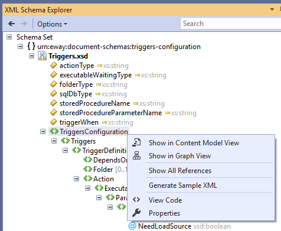

# Work with triggers
This page should give you insight for how triggers work, what you can do with them and which parameters you can use.

## XSD Definition Schema

We have provided our XSD definition schema for download. If you do so, you can use it in visual studio to validate your trigger XML script. To link it, go to properties f chosen XML file and in "Schemas" choose our XSD file.

Now you can start creating your trigger.

##  Choose when the trigger will be activated
Trigger definition gives the trigger information when should it activate. This can be either by action such as delete,save etc. or by specifying time of activation.

### Activating on Item action
This definition makes the trigger activate on specified item action. Bellow is link to example of "AfterSave" activation. That means the trigger will activate after an item in eWay-CRM is saved.
Click [here](TriggerDefinition/AfterSave/README.md) for example

### Job
This definition makes the trigger activate on specific time.
Click [here](TriggerDefinition/ScheduledAtTime/README.md) for example

## What is it that you want to trigger?
Action type is what the trigger is "triggering". That could be either executable program or stored SQL procedure.

### StoredProcedure
"StoredProcedure" trigger will activate stored procedure of your specification. This procedure must be stored on your local Database.
Click [here](ActionType/StoredProcedure/README.md) for example

### Executable
"Executable" trigger will activate .exe file of your specification.
Click [here](ActionType/Executable/README.md) for example

## Check out trigger template
If you open our provided XSD file in visual studio, you can generate template trigger with no filled values. To do tat, right click on "TriggersConfiguration" and find "Generate Sample XML".

 

## Folder names
To ease understanding folder names, look [here](FolderNames.md).

