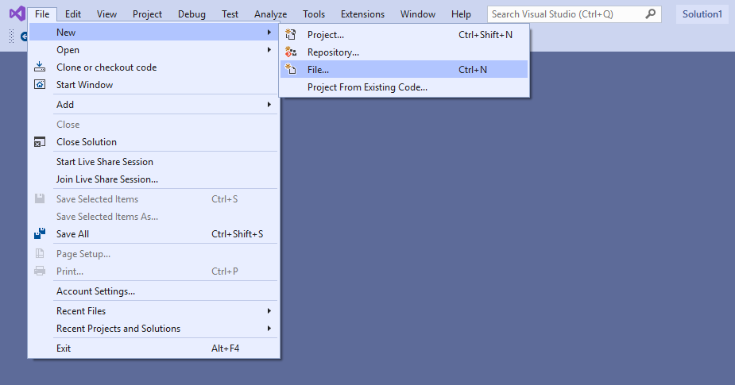
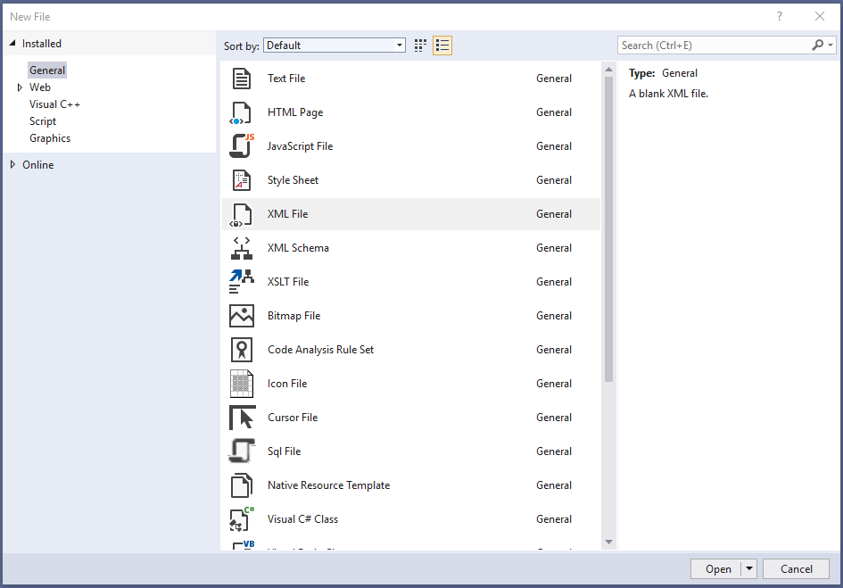
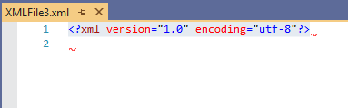

# Work with Triggers
This page should give you insight on how triggers work, what you can do with them and which parameters you can use.

> [!CAUTION]
> Before updating eWay-CRM make sure to read about [Breaking Changes](Breaking%20Changes.md).

## Use good XML editor with XSD validation
To work with XML Triggers we advise to use Microsoft Visual Studio. You can download free version [here](https://visualstudio.microsoft.com/downloads/). Click on download and then install the application. Once you have it installed, open Visual Studio and click on "File", "New" and then "File..." in next context menu.



File type selection then appears. Here you have to choose "XML File". While this option is chosen, click on "Open" Button to open the new file.



This new file will be empty XML File with only standard definition `<?xml version="1.0" encoding="utf-8"?>` on the first line.



## Download XSD Schema for validation of Triggers

We have provided our XSD definition schema for [download](https://github.com/eway-crm/triggers/raw/master/Triggers.xsd). If you do so, you can use it in Visual Studio to validate your XML Trigger. To use it, right click into the opened XML file and go to Properties. In "Schemas" specify path to the downloaded XSD file.


Now you can start creating your Trigger.

## Standard trigger configuration
Every Trigger should start with a standard specification:
```xml
<?xml version="1.0" encoding="utf-8"?>
<TriggersConfiguration xmlns="urn:eway:document-schemas:triggers-configuration">
	<Triggers>

	</Triggers>
</TriggersConfiguration>
```

##  Choose when the trigger will be activated
Trigger definition gives the Trigger information when it should be activated. This can be either by action such as delete or save or by specifying time of activation.
```xml
<TriggerDefinition Active="" When="">
</TriggerDefinition>
```
"Active" can be either true or false. That indicates, if the trigger will be executed. Perhaps you want to have it inactive for some time, but don't want to delete it, you set it to false. You can also fit more than one trigger definitions inside `<Triggers></Triggers>`, resulting in having multiple triggers in one file.

"When" than defines what action will activate the Trigger. Item related actions are called **[Triggers](#Trigger)** (BeforeSave, AfterSave, ...), time related actions are called **[Jobs](#Job)** (ScheduledAtTime).
* BeforeSave
* AfterSave
* AfterInsert (v8.3+)
* AfterUpdate (v8.3+)
* BeforeRemove
* AfterRemove
* ScheduledAtTime

### Trigger
This definition makes the trigger activate on specified item action. Bellow is link to example of "AfterSave" action. That means the trigger will activate after an item in eWay-CRM is saved.

Click [here](TriggerDefinition/AfterSave/README.md) for example.

In this case we additionally have to specify "FolderName". That defines on which item will the action be executed.
```xml
<Folder></Folder>
```
To ease understanding Folder names, look [here](https://github.com/eway-crm/php-lib/blob/master/FolderNames.md).

### Job
This definition makes the trigger activate at specific time. That means either just once, or periodically in times of your own choosing.

Click [here](TriggerDefinition/ScheduledAtTime/README.md) for example

## What action you want to trigger?
Action type specifies whether you want to execute [T-SQL Store Procedure](#Stored-Procedure) or [Executable program](#Executable).

### Stored Procedure
"StoredProcedure" trigger will activate Stored Procedure of your specification. This procedure must be stored on the eWay-CRM server database. You can fit more than one definition of stored procedure in here, in case you want to activate multiple procedures at once.
```xml
<Action Type="StoredProcedure">
	<StoredProcedures>
		<StoredProcedure Name="" CommandTimeout="" QueueOnly="1">

		</StoredProcedure>
	</StoredProcedures> 
</Action>
```

Stored Procedure parameters are defined in the **Parameters** tag. Here is a list of attributes that can be used in **StoredProcedureParameter**:

* **SourceName**
Name of the database column.
* **Name**
Name of the input parameter of the stored procedure including @.
* **NeedLoadSource**
True to load value from the database instead of using the value provided by the client. Default is False.
* **SqlDbType**
Type of the input parameter of the stored procedure and the database column as well.
* **Value**
Static value provided to the stored procedure instead of the SourceName. This can be a static value, [SQL command](#SQL-Queries) or one of our [system variables](#System-Variables).
* **UsePreviousValue**
True to provide previous value to the stored procedure instead of value provided by the client.
* **UseCurrentFolder**
Provide current folder name as input of the stored procedure.

```xml
<StoredProcedure Name="">
	<Parameters>
		<StoredProcedureParameter Name="@GrouName" Value="Director" SqlDbType="NVarChar" />
		<StoredProcedureParameter Name="@LeadGUID" SourceName="ItemGUID" SqlDbType="UniqueIdentifier" />
	</Parameters>
</StoredProcedure>
```
Input parameter in Stored Procedure will now be supplied with static value `Director`.

Click [here](TriggerDefinition/AfterSave/README.md) for example.

Please use our template to create T-SQL Procedure. You can find it in our [Snippets](https://github.com/eway-crm/Snippets).

Writting triggers requires T-SQL knowledge. Checkout our [Database Schema](https://dev.eway-crm.com/docs/database-schema.html) to find description of standard system Procedures and Functions that can be used right away.

> [!CAUTION]
> Breaking changes in 7.6
> We have redefined execution limits for StoredProcedure triggers. For Jobs the default limit is **15 minutes**, for triggers it is only **1 second**.

> [!NOTE]
> You can change the limit using CommandTimeout attribute. CommandTimeout is in seconds, however it is not recommended to make the timeouts too big. Triggers are executed in
> transaction, they block the user interface in case of eWay-CRM Online.

Normally triggers take only a few milliseconds to execute. In the case of email notifications, it may take more time, since the notification is send synchronously.
It is not recommended to send email notifications synchronously in trigger, because if the transaction is rollbacked the notification might be already sent, which may
cause multiple notifications to be send.

You can use the new flag QueueOnly, which means that the procedure is executed later using Timer. There is a limit for 15 (+5 NVARCHAR) parameters.
If you have more parameters you can execute the trigger normally and just manually add the execution of **eWaySP_SendMail** procedure into the queue:

```xml
EXEC dbo.eWaySP_AddProcedureIntoJobQueueWithNamedParameters 'eWaySP_SendMail', '@to', @EmailTo, '@subj', @EmailSubject, '@replyTo', @EmailFrom, @TextParameter1Name = '@text', @TextParameter1Value = @EmailBody
```

### Executable
"Executable" trigger will activate .NET Assembly (.exe file) of your specification. See [SampleExecutableTrigger](https://github.com/eway-crm/SampleExecutableTrigger) for more details about implementation.

> [!CAUTION]
> Starting with eWay-CRM 8.0 code is executed in restricted environment. Use [SandboxRunner](https://github.com/eway-crm/SandboxRunner) to test your code will be able to run!

> [!NOTE]
> The trigger should wrap all unhandled exceptions to InvalidOperationException, otherwise `System.Security.Permissions.SecurityPermission` may also be triggered.
> You should catch all Exceptions, log them and call `throw new InvalidOperationException(ex.Message);`.
> You may also use `USER_FRIENDLY_ERROR::` prefix if you want to display the message to user: `throw new InvalidOperationException("USER_FRIENDLY_ERROR::Email format is not correct");`

```xml
<Action Type="Executable">
	<Executable Target="" WaitingType="">
	</Executable>
</Action>
```
The executable is specified by path to in an your storage. There is also an option to choose, if the trigger will be handled as transaction. This is done by assigning one of the values listed below in the  `WaitingType=""`  attribute.

* **WaitInTransaction**  The executable process will be launched inside the item's saving / removing transaction and we will also wait for it's ending. If an error occurs, the saving / removing transaction will fail like for example the SQL Triggers do. The saving / removing routine does not end before the trigger process finishes (eWay-CRM synchronization that caused the operation is waiting for the end).
* **WaitOutsideTransaction**  The executable process will be launched inside the transaction repeater and the process handle will be saved. Later, after the transaction finishes its work, the saving routine will wait for the process handle to end. If an error occurs, the saving / removing transaction is already committed and the ReturnCode will not be affected. An email will be however sent to the SystemHealthNotification group. The saving / removing routine does not end before the trigger process finishes (eWay-CRM synchronization that caused the operation is waiting for the end).
* **NoWaiting**  The executable process will be launched inside the transaction repeater and the process handle will not be stored. If an error occurs, the saving / removing transaction is already committed and the ReturnCode will not be affected. No email nor a log message is provided.
    

Note that using WaitInTransaction may cause a deadlock. This may occur when the executable you want to trigger saves data back to the eWay-CRM using eWay-CRM API.

Parameters for executable are, same as the Stored Procedure parameters, defined in the Parameters tag.

```xml
<Executable Target="" WaitingType="">
	<Parameters>
		<Parameter Value="Director" SqlDbType="NVarChar" />
		<Parameter SourceName="ItemGUID" SqlDbType="UniqueIdentifier" />
	</Parameters>
</Executable>
```

Here is a list of attributes that can be used in Parameter:

* **SourceName**
Name of the database column.
* **NeedLoadSource**
True to load value from the database instead of using the value provided by the client. Default is False.
* **SqlDbType**
Type of the input parameter of the executable and the database column as well.
* **Value**
Static value provided to the executable instead of the SourceName. This can be a static value, [SQL command](#SQL-Queries) or one of our [system variables](#System-Variables).
* **UsePreviousValue**
True to provide previous value to the executable instead of value provided by the client.
 * **UseCurrentFolder**
Provide current folder name as input of the executable.

Click [here](TriggerDefinition/ScheduledAtTime/README.md) for example.

## Action criteria

### Triggers

Action criteria specifies conditions that indicates whether the trigger will be activated for the item or not by checking item's value on a specified column.

For triggers you may use the following attributes:
* **Name** - Name of the column
* **Operator** - Operator used to determine if the condition is fulfilled (default Equals)
  * **Equals** - Is true if value of the column is equal to value in Value attribute.
  * **EqualsFolderName** - Compares ObjectTypeID with FolderName provided in Value attribute.
  * **NotEquals** - Is true if value of the column is **not** equal to value in Value attribute.
  * **StartsWith** - Is true if value of the column start with value in the Value attribute.
* **IsChanged** - Is true when the value of the column has been changed. For new items IsChanged is true when there is some value in the column.
* **Value** - Value which we compare against the column value. It can be static value or [system variable](#System-Variables). May also contain an [SQL expression](#SQL-Queries): `Value="SQL#SELECT U.[ItemGUID] FROM [Users] U WHERE U.[UserName] = 'admin'"`
```xml
<Criterias>
	<ActionCriteria Name="ObjectTypeID1" Value="Tasks" Operator="EqualsFolderName" /><!-- ObjectTypeID1 in Relation is a Task -->
	<ActionCriteria Name="ItemVersion" Value="1" /><!-- ItemVersion equals 1 -->
	<ActionCriteria Name="CreatedByGUID" Value="SQL#SELECT U.[ItemGUID] FROM [Users] U WHERE U.[UserName] = 'admin'" /><!-- Item is created by user admin -->
	<ActionCriteria Name="OwnerGUID" Operator="IsChanged"/><!-- Owner of item has changed -->
	<ActionCriteria Name="OwnerGUID" Operator="NotEquals" Value="$CURRENT_USER[ItemGUID]"/><!-- Owner of the item is not current user -->
	<ActionCriteria Name="Default" Operator="Equals" Value="True" /><!-- For BIT columns the values are True / False (case sensitive) -->
</Criterias>
```

Click [here](TriggerDefinition/AfterSave/README.md) for full example.

### Jobs

In case of [Job](#Job), we define time of the execution. Only **Name** and **Value** attributes are used. Those special values in **Name** are supported:

#### Time
This criteria defines starting time for the job. The time format is `h:m:s`. The job will activate at the specified time, relative to 00:00. In the example bellow the value set to 00:40:00 (40 minutes after midnight).

#### Repeat
Repeat determines that your jobs will activate repeatedly. In the example bellow we have `Value="d"`, which means it will repeat every day. In this case each day at 00:40. This criteria can have following values:

* **d** for daily
* **wd** for daily but only on work days (Monday till Friday)
* **w** for weekly
* **m** for monthly
* **y** for yearly

#### DayOfWeek
Used by **weekly** jobs. Defines day of week in which the job should be executed.

Possible values are:
* **Sunday**
* **Monday**
* **Tuesday**
* **Wednesday**
* **Thursday**
* **Friday**
* **Saturday**

```xml
<Criterias>
	<ActionCriteria Name="Time" Value="01:00:00"/>
	<ActionCriteria Name="Repeat" Value="w"/>
	<ActionCriteria Name="DayOfWeek" Value="Monday"/>
</Criterias>
```

#### DayOfMonth
Used by **monthly** jobs. Defines day of month in which the job should be executed.

```xml
<Criterias>
	<ActionCriteria Name="Time" Value="01:00:00"/>
	<ActionCriteria Name="Repeat" Value="m"/>
	<ActionCriteria Name="DayOfMonth" Value="10"/>
</Criterias>
```

#### DayOfYear
Used by **yearly** jobs. Defines day and month of the year in which the job should be executed.

```xml
<Criterias>
	<ActionCriteria Name="Time" Value="01:00:00"/>
	<ActionCriteria Name="Repeat" Value="y"/>
	<!-- Date format should be d/M -->
	<ActionCriteria Name="DayOfYear" Value="1/1"/>
</Criterias>
```

#### IterationCount
IterationCount is number of times that the job will activate. Its value is number. In the case below the value is 23, so the trigger will activate each day 23 times. 
 
#### Frequency
This is time after which the next iteration will start. It's value is given in minutes. In the case below we set it to 60, so the trigger will activate daily, 23 times after 60 minutes.

```xml
<Criterias>
	<ActionCriteria Name="Time" Value="00:40:00"/>
	<ActionCriteria Name="Repeat" Value="d" />
	<ActionCriteria Name="IterationCount" Value="23"/>
	<ActionCriteria Name="Frequency" Value="60"/>
</Criterias>
```

Click [here](TriggerDefinition/ScheduledAtTime/README.md) for full example.

## SQL Queries, System Variables and Client Types
When defining Stored Procedure parameter, Executable parameter or Action Criteria we can use SQL Queries or System Variables as value.

### SQL Queries
There is an option to run SQL queries to take something from database as value. To initiate it, write this: `Value="SQL#"`. SQL query is placed after # character. Checkout our [Database Schema](https://dev.eway-crm.com/docs/database-schema.html) to orient yourself in the format used in these queries. 

### System Variables
You may also use our System Variables to use in-memory data:
* **CURRENT_ITEM** - This gets you database record of the item the trigger is currently working on.
* **CURRENT_USER** - This gets you database record of the user that is currently logged in eWay-CRM.
* **CURRENT_ITEM_OWNER** - This gets you database record of the user owning the item the trigger is currently working on.

To get to the actual value we have to specify column in bracket behind the variable. Here is an example:
```xml
<Criterias>
	<ActionCriteria Name="$CURRENT_ITEM_OWNER[ItemGUID]" Operator="NotEquals" Value="$CURRENT_USER[ItemGUID]"/><!-- Curent user is not owner of the current item -->
<Criterias/>
```

### Client Types
Client Type identifies client which initiated the trigger. There is a list of known clients and any other unknown client is labeled as "Other":
* **OutlookClient** - eWay-CRM Outlook Client
* **WebAccess** - eWay-CRM Web Access
* **WebService** -  eWay-CRM Web Service
* **AdministrationApplication** - Administration Application
* **PHPClient** - PHP API class
* **UnitTests** - Unit tests
* **MobileClient** - eWay-CRM mobile
* **Other** - Some other application

Operators that can be used with client types are **Equals** and **NotEquals**. Here is an example of how to use Client Type to restrict trigger only for known types of clients:
```xml
<Criterias>
	<ActionCriteria Name="$ClientType" Value="Other" Operator="NotEquals"/>
<Criterias/>
```
