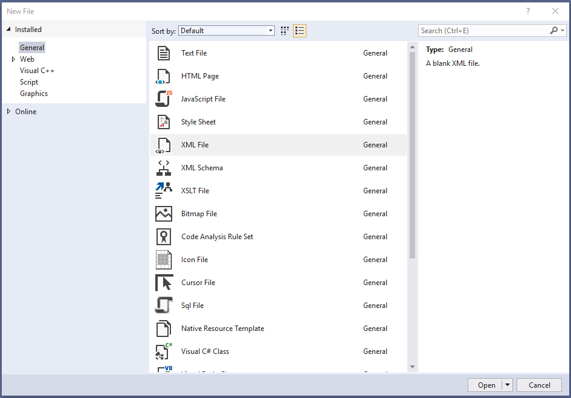
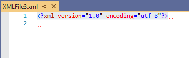
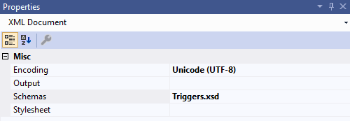

# Work with triggers
This page should give you insight for how triggers work, what you can do with them and which parameters you can use.

## Download Visual Studio
To work with XML Triggers we advise to use Microsoft Visual Studio. You can download free instance [here](https://code.visualstudio.com/?wt.mc_id=vscom_freedevoffers). Click on download and then install the application. Once you have it installed, open the Visual Studio and click on "File" and "New" in context menu and "File.." in the next context menu.


File type selection then appears. Here you have to choose "XML File". While this option is chosen, click on "Open" Button to open the new file.



This new file will be empty XML File with only standard `<?xml version="1.0" encoding="utf-8"?>` on the first line. Now you are ready to start writing the trigger.



## XSD Definition Schema

We have provided our XSD definition schema for download. If you do so, you can use it in visual studio to validate your trigger XML script. To link it, go to properties f chosen XML file and in "Schemas" choose our XSD file.


Now you can start creating your trigger.

## Standard trigger configuration
Every Trigger should start with this standard configuration:
```xml
<TriggersConfiguration xmlns="urn:eway:document-schemas:triggers-configuration">
    <Triggers>
    
    </Triggers>
</TriggersConfiguration>
```
Inside, we can start defining the trigger.

##  Choose when the trigger will be activated
Trigger definition gives the trigger information when should it activate. This can be either by action such as delete,save etc. or by specifying time of activation.
```xml
<TriggerDefinition Active="" When="">
</TriggerDefinition>
```
"Active" can be either true or false. That indicates, if the trigger even can be activated. Perhaps you want to have it inactive for some time, but dont want to delete it, you set it to false.

"When" than defines what is the impulse for triggerring. Here is two ways of setting that up:

### Trigger
This definition makes the trigger activate on specified item action. Bellow is link to example of "AfterSave" activation. That means the trigger will activate after an item in eWay-CRM is saved.
Click [here](TriggerDefinition/AfterSave/README.md) for example

In this case we additionally have to specify "FolderName". That defines on which eWay-CRM Item will we observe the action.
```xml
<Folder></Folder>
```
To ease understanding folder names, look [here](FolderNames.md).

### Job
This definition makes the trigger activate on specific time. That means either just once, or periodically in times of your own choosing.
Click [here](TriggerDefinition/ScheduledAtTime/README.md) for example

## What is it that you want to trigger?
Action type is what the trigger is "triggering". That could be either executable program or stored SQL procedure.

### StoredProcedure
"StoredProcedure" trigger will activate stored procedure of your specification. This procedure must be stored on your local Database.
```xml
<Action Type="StoredProcedure">
</Action>
```
Click [here](ActionType/StoredProcedure/README.md) for example

For the procedure to have correct format, please use our SQL snippet with predefined templates. You can find that [here](https://github.com/eway-crm/Snippets).

Writting triggers requires T-SQL knowledge. Checkout our [Database Schema](https://dev.eway-crm.com/docs/database-schema.html) to find a lot of system procedures and functions that can be used right away.

### Executable
"Executable" trigger will activate .exe file of your specification.
Click [here](ActionType/Executable/README.md) for example
```xml
<Action Type="Executable">
</Action>
```


