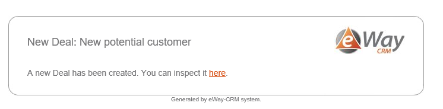

# AfterSave Stored Procedure trigger example
This example will show trigger, which sends email, after Deal is saved. Lets say we want to notify users about new Deal created from a web page using API (the user used by the API is also called api):

```xml
<?xml version="1.0" encoding="utf-8" ?>
<TriggersConfiguration xmlns="urn:eway:document-schemas:triggers-configuration">
    <Triggers>
        <TriggerDefinition Active="true" When="AfterSave">
            <Folder>Leads</Folder>
            <Action Type="StoredProcedure">
                <StoredProcedures>
                    <StoredProcedure Name="eWaySP_NotifyAboutNewDeal">
                        <Parameters>
                            <StoredProcedureParameter Name="@LeadGUID" SourceName="ItemGUID" SqlDbType="UniqueIdentifier" />
                            <StoredProcedureParameter Name="@LeadFileAs" SourceName="FileAs" SqlDbType="NVarChar" />
                        </Parameters>
                    </StoredProcedure>
                </StoredProcedures>
                <Criterias>
                    <ActionCriteria Name="CreatedByGUID" Operator="Equals" Value="SQL#SELECT U.[ItemGUID] FROM [Users] U WHERE U.[UserName] = 'api'" />
                    <ActionCriteria Name="OwnerGUID" Operator="NotEquals" Value="$CURRENT_USER[ItemGUID]" />
                </Criterias>
            </Action>
        </TriggerDefinition>
    </Triggers>
</TriggersConfiguration>
```

## Circumstances of activation
Trigger definition "When" will define when the trigger will activate. Value "AfterSave" ensures that the activation will occur after saving an item in eWay-CRM. Also note the "Active" parameter. Its value can be either false or true and determine that  even when the trigger is on your server, you can prevent its activation even when the circumstances of activation occures.

## Item which is being saved
We will specify the folder as "Leads", since we want the email to send only in case of Deal saving. Note that FolderName is internal name of the table in system, which is Leads, but module is currently called Deals in GUI.

## What will be activated
This trigger is supposed to execute [eWaySP_NotifyAboutNewDeal](https://github.com/eway-crm/triggers/blob/master/TriggerDefinition/AfterSave/eWaySP_NotifyAboutNewDeal.sql) Stored Procedure. We specify that in "Action" section by `Type="StoredProcedure"`. We also have to specify name, in this case that is `Name="eWaySP_NotifyAboutNewDeal"`. This procedure must be stored on your eWay-CRM server database.

## Procedure parameters
Our procedure have two input parameters. We want to supply the first one with GUID of Deal that is being saved and the second one with name of the Deal. That means specifying:

* **Name** - Name of the parameter in procedure
* **SourceName** - Name of column from database, which will be supplied to the parameter
* **SlDbType** - Type of this parameter

## Conditions
The first condition ensures that we notify users (owners of new deals) about new deals created by the **api** user. We might also just specify GUID of the **api** user, but in the sample we will show how to use SQL query in the ActionCriteria.

 * **Name** - Name of the column (in this case `Name="CreatedByGUID"`)
 * **Operator** - Operator used to determine if the condition is fulfilled `Operator="Equals"`. It 				can have following values:  
 **Equals** - Compares and is true if both sides are equal. Also is the default value.
 **EqualsFolderName** - Compares folder names and is true if both sides are equal.
 **NotEquals** - Compares and is true if the sides are not equal.
 **StartsWith** - Is true if the given parameter starts with specified string.
 **IsChanged** - Is true when the given parameter was changed.
 
 * **Value** - Value which we compare against the column value `Value="#SQL SELECT U.[ItemGUID] FROM [Users] U WHERE U.[UserName] = 'api'"`

The second condition is not really necessary here, but it shows how to use system variables. The condition checks that notification will be send only when the new Owner of Deal differs from the user who created the Deal. We use operator `Operator="NotEquals"` and value `Value="$CURRENT_USER[ItemGUID]"` which is system variable that gives us GUID of current user.

## Stored procedure
This is the Stored Procedure that will be invoked by the trigger:

```SQL
CREATE PROCEDURE [dbo].[eWaySP_NotifyAboutNewDeal]
(
	@LeadGUID UNIQUEIDENTIFIER,
	@LeadFileAs NVARCHAR(MAX)
)
AS
BEGIN
	SET NOCOUNT ON;

	SET XACT_ABORT ON;

	DECLARE @To NVARCHAR(MAX)
	DECLARE @Body NVARCHAR(MAX)

	SET @To = 'jiri.patera@eway-crm.com';
	SET @Body = 'A new Deal has been created. You can inspect it <a href="eway://Leads/' + CAST(@LeadGUID AS CHAR(36)) + '">here</a>.';
	SET @LeadFileAs = 'New Deal: ' + @LeadFileAs

	EXECUTE [dbo].[eWaySP_SendMail] @To, @Body, @LeadFileAs
END
GO
```

On activation the trigger will supply input parameter `@LeadFileAs` with name of the Deal being saved, as we specified it. The procedure will result in sending an email to address provided by `@To` variable. Also the `@LeadGUID` will be supplied and used in `<a href="eway://leads/' + cast(@LeadGUID as nvarchar(64)) + '">here</a>` to create link to the Deal.

For the procedure to have correct format, please use our SQL snippet. You can find that [here](https://github.com/eway-crm/Snippets).

## Outcome
This series of actions should result in getting this email with a link to the new Deal:
